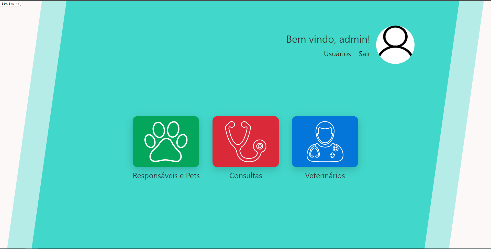
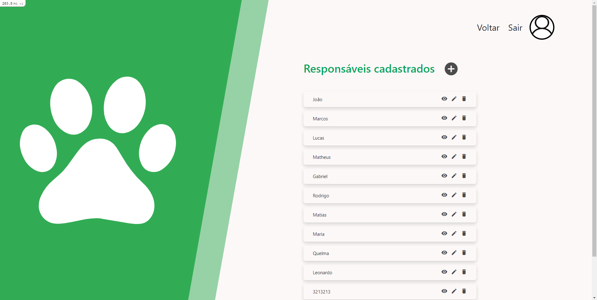
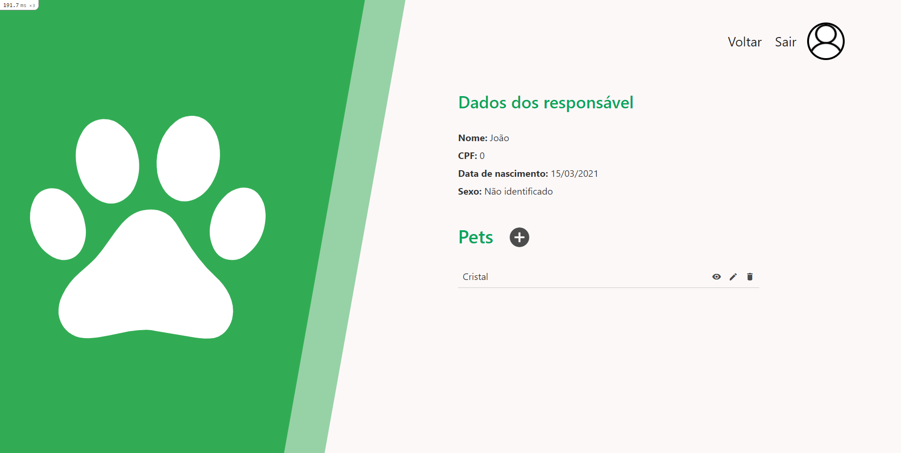
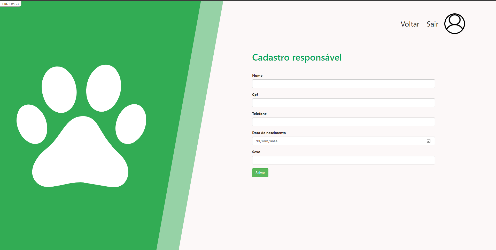
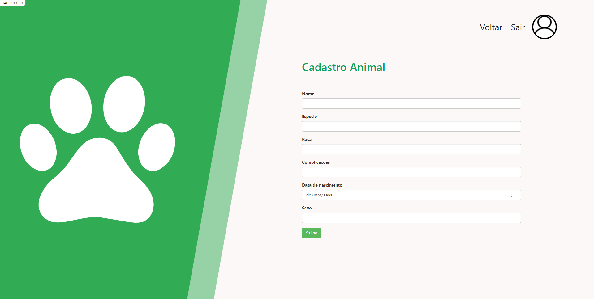
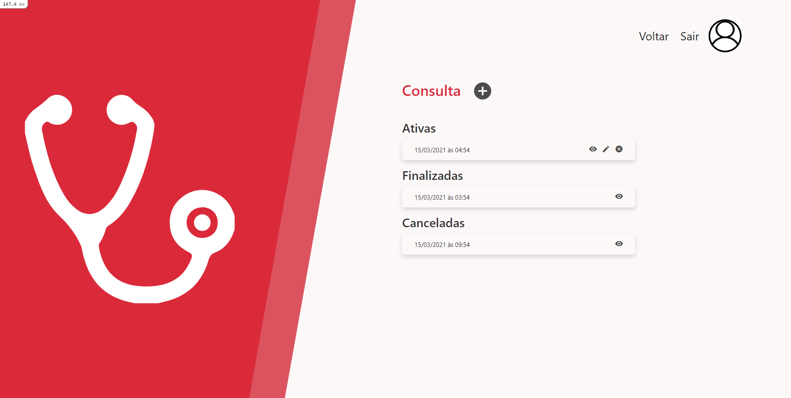
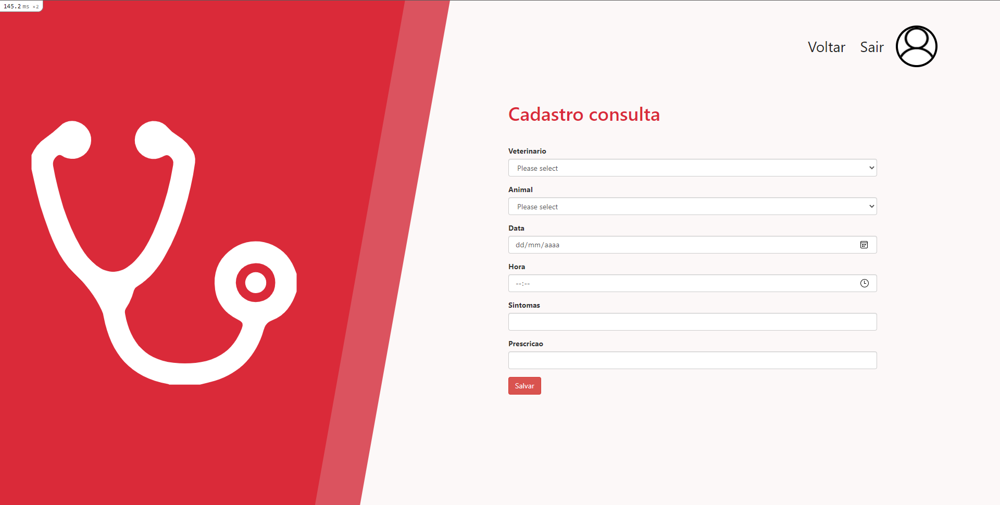
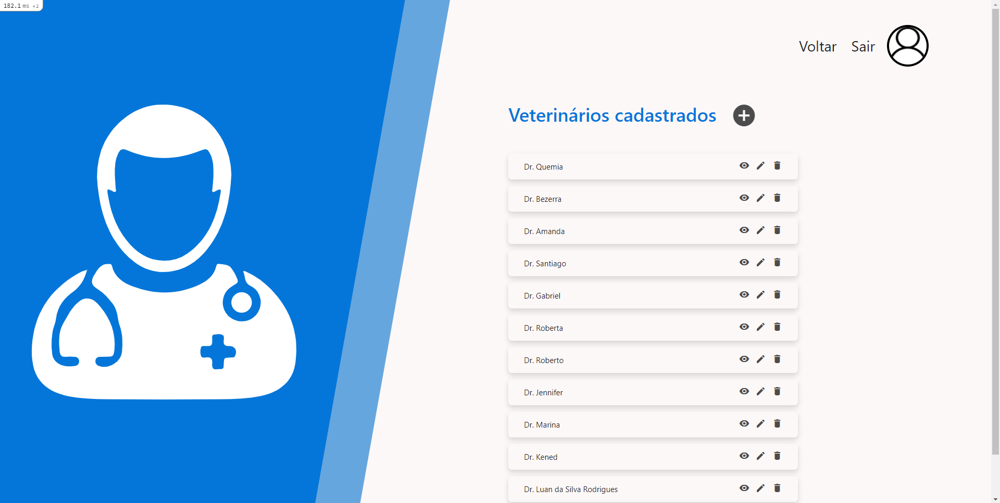
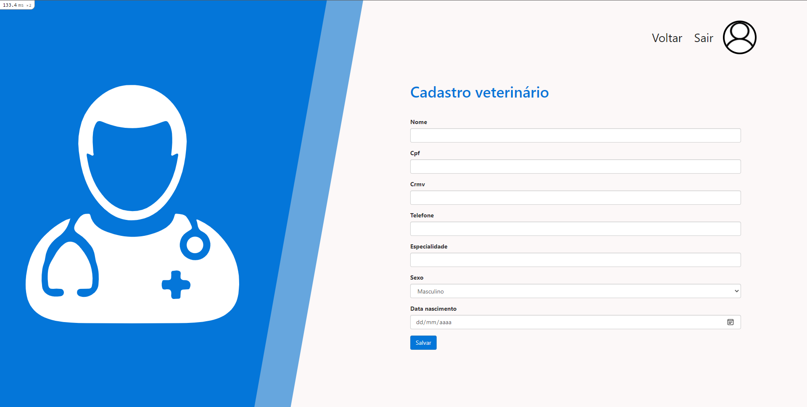

# README

This README would normally document whatever steps are necessary to get the
application up and running.

Things you may want to cover:

* Ruby version

* System dependencies

* Configuration

* Database creation

* Database initialization

* How to run the test suite

* Services (job queues, cache servers, search engines, etc.)

* Deployment instructions


## Como criar um admin

abrir o `rails console` e digitar o seguinte comando alterando os dados necessários.

**Obs**:  não alterar o valor `tipo_usuario`

```ruby
User.create!({:email => "emsssesdsail@admins.com", :password => "123456", :tipo_usuario => :admin })
```


# Imagens do sistema

### Home

 


### Eesponsáveis e veterinários
 




### Consulta



### Veterinario


